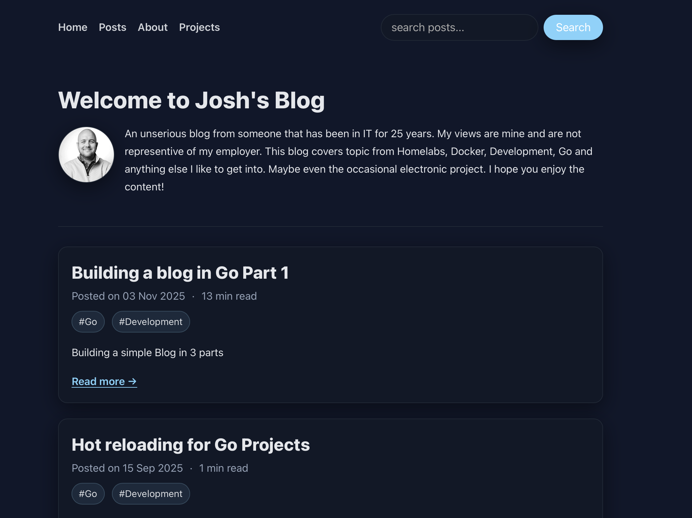

# Blogo

Blogo is a lightweight, fast, and customizable blog engine written in Go, designed to run with minimal dependencies. It reads content directly from Markdown files, supports flexible theming, and leverages Go’s standard library for reliable performance. Themes are easy to create and manage, combining templates, CSS, and JavaScript for a unique look and feel. Blogo is ideal for anyone who wants a simple, efficient blogging platform that’s easy to extend and maintain.



## TODO

- Fix the theme support to reduce duplication in code

## Installation

```bash
# Clone the repository
git clone https://github.com/joshhartwig/blogo.git
cd blogo

# Build and Start the container
docker compose up --build
```

## Features

- No database needed, reads markdown files direct from content directory
- Leverages built in standard libraries for almost everything short of Markdown & Frontmatter parsing.
- Lightweight

## Contributing

None needed.

## License

This project is licensed under the [MIT License](LICENSE).
